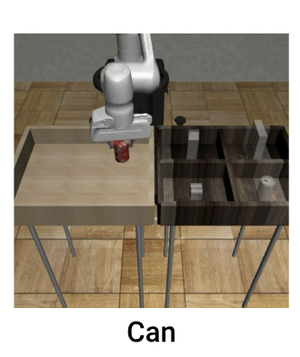
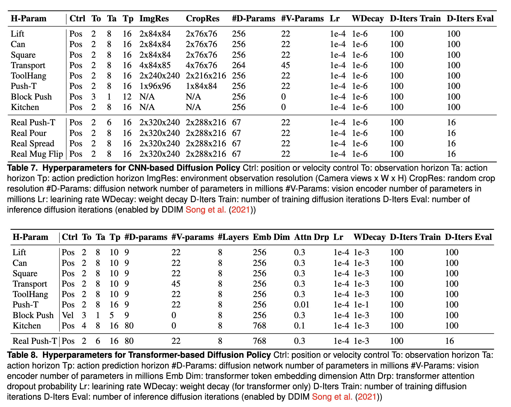
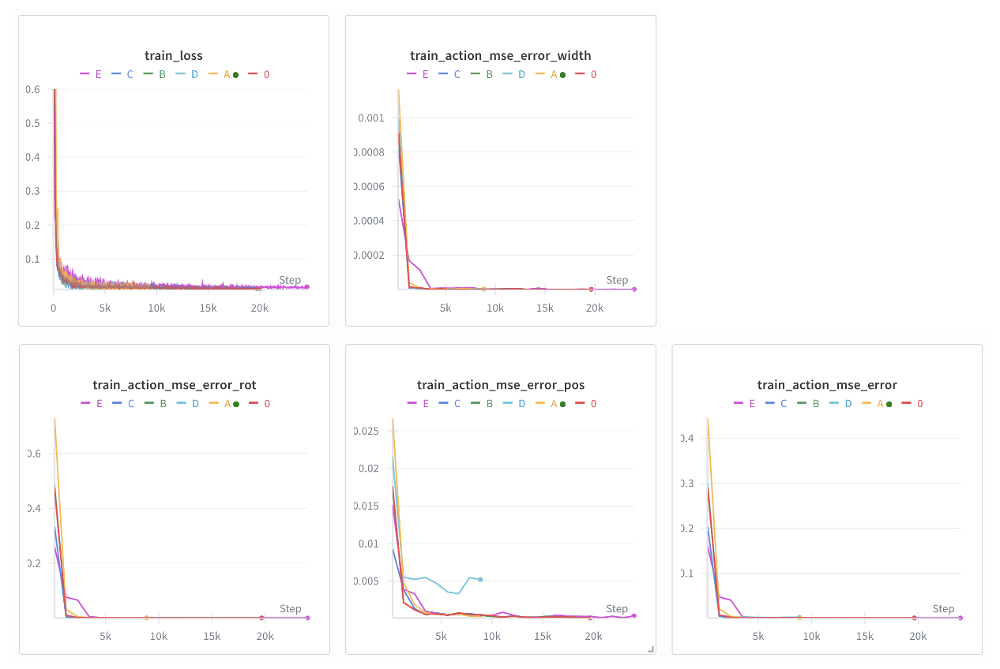
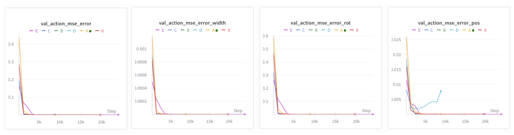

# Diffusion Policy Training Experiments

This report documents a series of 6 experiments (0, A, B, C, D, E) conducted to evaluate the performance of the Diffusion Policy on the UMI task. The experiments investigate the impact of learning rates, action execution horizons, denoising schedules, visual encoders, and policy architectures.

Some of the experiment hyperparameter settings are based on the original paper’s **Can** task, which we believe is more similar to our task.

## Experiment 0: Baseline

**Settings:** Default Configuration

### Description
This experiment serves as the **baseline** for all subsequent comparisons. It uses the default parameters specified in the `train_diffusion_unet_timm_umi_workspace.yaml` configuration file.

### Key Hyperparameters (Default)
* **Policy Architecture:** Conditional U-Net 1D (CNN-based diffusion).
* **Visual Encoder:** ViT (Vision Transformer) `vit_base_patch16_clip_224.openai`, pre-trained with CLIP.
* **Prediction Horizon ($T_p$):** 16 (Default for UMI).
* **Observation Horizon ($T_o$):** 2.
* **Action Execution Horizon ($T_a$):** 8.
* **Noise Scheduler:** DDIM with 50 training steps and 16 inference steps.
* **Optimizer:** AdamW with Learning Rate = `3.0e-4`.

---

## Experiment A: Reduced Learning Rate
**Command Modification:** `optimizer.lr=1.0e-4`

### Description
In this experiment, the **Learning Rate (LR)** was reduced from the default `3.0e-4` to `1.0e-4`.

### Theoretical Context
* **Optimization Stability:** Diffusion models can be sensitive to the learning rate. While a higher LR (`3e-4`) accelerates convergence, it may lead to unstable loss curves or suboptimal local minima.
* **Fine-tuning:** A lower LR (`1e-4`) is often preferred when fine-tuning pre-trained components (like the CLIP visual encoder) or when the loss function exhibits high variance, ensuring smoother convergence.

---

## Experiment B: Increased Action Execution Horizon
**Command Modification:** `n_action_steps=12`

### Description
The **Action Execution Horizon ($T_a$)** was increased from the default **8 steps** to **12 steps**. This means the robot executes 12 steps of the predicted trajectory open-loop before replanning.

### Theoretical Context (Diffusion Policy Paper)
* **Receding Horizon Control:** The paper introduces $T_a$ as a critical parameter for temporal consistency.
* **Trade-off:**
    * **Higher $T_a$ (e.g., 12):** Results in smoother robot motions and reduces the computational cost of inference (since the policy is queried less frequently). However, it reduces the effective control frequency, making the robot slower to react to dynamic disturbances.
    * **Lower $T_a$ (e.g., 4 or 8):** Increases reactivity but requires higher inference speed and may introduce jitter if the adjacent predictions are not consistent.

---

## Experiment C: High-Fidelity Denoising (DDPM-like)
**Command Modification:** `policy.noise_scheduler.num_train_timesteps=100`, `policy.num_inference_steps=100`

### Description
This experiment aligns the training and inference diffusion steps to **100**, effectively switching from a fast approximation (DDIM) to a high-fidelity generation process similar to the original DDPM (Denoising Diffusion Probabilistic Models).

### Theoretical Context
* **Training vs. Inference Gap:** The baseline uses a "short" training schedule (50 steps) and an accelerated inference (16 steps) for speed.
* **Generation Quality:** Increasing the steps to 100 minimizes the discretization error during the reverse diffusion process.
* **Paper Insight:** The original Diffusion Policy paper highlights that while few-step inference is possible, full-step inference (e.g., 100 steps) typically yields the highest success rates and trajectory quality, albeit at the cost of significantly higher inference latency (approx. 6x slower).

---

## Experiment D: ResNet Visual Encoder
**Command Modification:** `policy.obs_encoder.model_name='resnet34.a1_in1k'`

### Description
The visual backbone was switched from the default **Vision Transformer (ViT-Base CLIP)** to a **ResNet-34 (CNN)** pre-trained on ImageNet.

### Theoretical Context
* **Architecture Inductive Bias:**
    * **ResNet (CNN):** Possesses strong inductive biases for translation invariance and locality, which are traditionally beneficial for Visuomotor control tasks. It is often more stable on smaller datasets.
    * **ViT (Transformer):** The default UMI configuration uses ViT because the original UMI paper found that CLIP-pretrained ViTs generalize better to "in-the-wild" environments with diverse lighting and textures compared to standard ResNets.
* **Comparison Goal:** This experiment tests whether the traditional robustness of CNNs performs better in the specific simulated environment of this project compared to the generalization-focused ViT.

---

## Experiment E: Transformer-Based Policy Architecture
**Command Modification:** `--config-name=train_diffusion_transformer_umi_workspace.yaml`

### Description
This experiment changes the core policy architecture from a **U-Net** to a **Transformer** (often referred to as the "Transformer Workspace").

### Theoretical Context (Diffusion Policy Paper)
* **Backbone Difference:**
    * **U-Net (Baseline):** Uses a 1D Conditional U-Net to process the action sequence. It is structurally similar to image generation models and excels at capturing local temporal dependencies.
    * **Transformer:** Uses a MinGPT-like or DiT (Diffusion Transformer) architecture. It treats the noise and conditions as tokens in a sequence.
* **Performance Characteristics:** The paper notes that while U-Net is often easier to train and more computationally efficient for continuous control, the Transformer backbone can potentially scale better with data and handle complex multimodal distributions, although it may be more sensitive to hyperparameter tuning.

---

# Result
### train loss

### validation loss

## 1. Metrics Definition: Action MSE
In the context of Diffusion Policy, the **Mean Squared Error (MSE)** quantifies the divergence between the policy's predicted action trajectory and the ground truth (expert demonstration).

| Metric | Definition & Physical Meaning |
| :--- | :--- |
| **`action_mse_error`**  | **Overall Prediction Fidelity** The average squared error across all action dimensions. It serves as a high-level summary of how well the model mimics the expert's behavior. |
| **`action_mse_error_pos`** | **End-Effector Position Error (Translation)** Measures the Euclidean distance error in 3D space (x, y, z). • **High Value:** The robot is moving to the wrong coordinate. • **Low Value:** The trajectory path is spatially accurate. |
| **`action_mse_error_rot`**  | **End-Effector Rotation Error (Orientation)** Measures the error in the 6D continuous rotation representation. • **High Value:** The hand is oriented incorrectly (e.g., wrong approach angle). |
| **`action_mse_error_width`**  | **Gripper State Error** Measures the error in the gripper opening width. • **High Value:** The model fails to capture the precise timing of opening/closing the gripper (e.g., releasing an object too early). |

---

## 2. Analysis: Performance Degradation in Experiment D
**Observation:** Experiment D (ResNet-34 Backbone) exhibited a higher (worse) `action_mse_error_pos` compared to the Baseline (ViT-Base CLIP).

This degradation is technically significant and stems from three key architectural and pre-training differences between the `resnet34.a1_in1k` and `vit_base_patch16_clip_224.openai` models.

### A. Pre-training Representation Quality (CLIP vs. ResNet)
The most critical factor is the pre-training objective.
* **Baseline (ViT):** Uses **CLIP** pre-training. CLIP is trained on massive image-text pairs to align visual concepts with semantic meaning. This creates robust, semantic-rich feature representations that are highly effective for "in-the-wild" manipulation tasks and generalized spatial reasoning.
* **Experiment D (ResNet):** Uses **ImageNet** supervised pre-training. ImageNet classification focuses heavily on distinguishing *object textures* (e.g., "fur of a dog") rather than precise *spatial relationships* or geometry, which are crucial for minimizing position error (`action_mse_error_pos`).

### B. Global Context vs. Local Receptive Fields
* **ViT (Transformer):** Uses Self-Attention mechanisms that allow every pixel (patch) to attend to every other pixel from the very first layer. This **Global Context** enables the model to better understand the relative position of the robot arm to the target object across the entire image.
* **ResNet (CNN):** Relies on convolution operations with limited local receptive fields. While deep layers eventually see the whole image, the down-sampling (pooling) operations inherent in CNNs often result in a loss of fine-grained spatial information, leading to less precise coordinate predictions.

### C. Model Capacity (86M vs. 21M Parameters)
* **Baseline (ViT-Base):** Has approximately **86 Million parameters**.
* **Experiment D (ResNet-34):** Has approximately **21 Million parameters**.
* **Conclusion:** The ResNet-34 is a significantly smaller model ("lighter backbone"). In complex imitation learning tasks like UMI, the larger capacity of the ViT allows it to capture more nuanced visuomotor mappings, resulting in lower error rates.